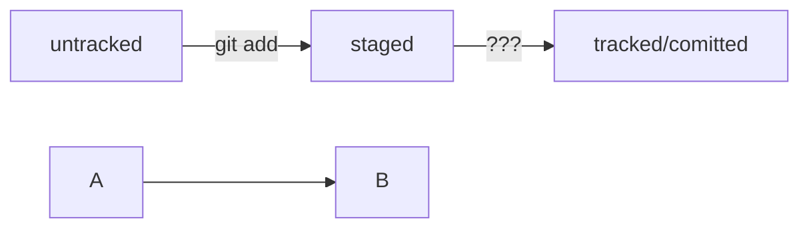

#  Первый README

###  краткая инструкция по GIT

#####  добавляем что надо

**git add**

---

создание коммита git commit -m "описание что изменили",
 
_добавить в репозиторий_ git push

#### Заголовок 4

Текст над чертой

---

Текст под чертой

Полужирный шрифт — двойные **звёздочки** или двойные __подчёркивания__.
Можно совместить выделение **звёздочки и _подчёркивания_**.

